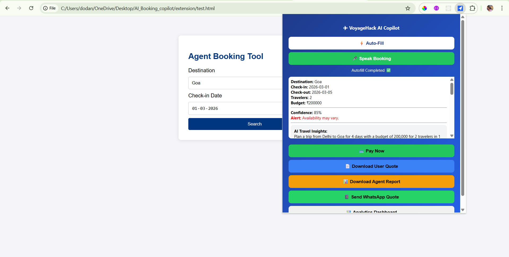
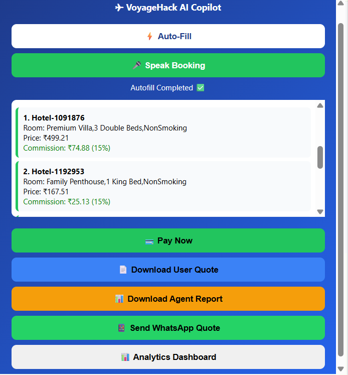
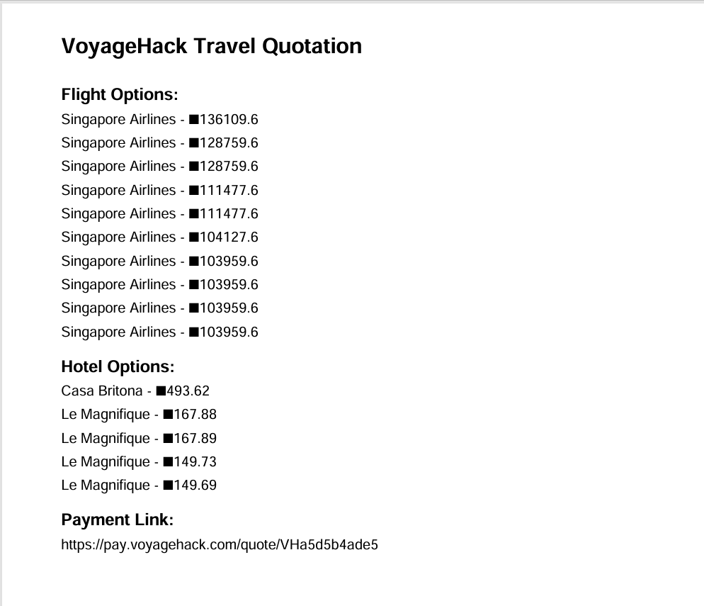
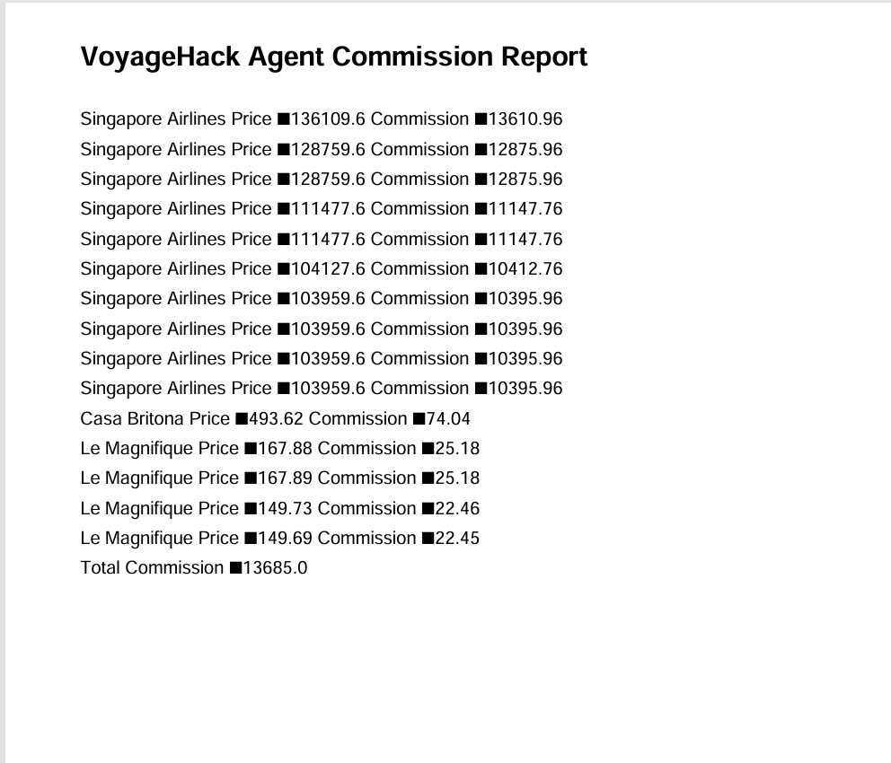
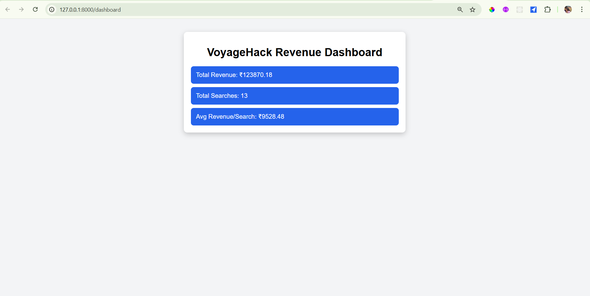

# ✈️ VoyageHack AI Travel Copilot

### AI-Powered Revenue Optimization & Booking Automation for Travel Agents

Built for **TBO VoyageHack 3.0 Hackathon**

VoyageHack AI Travel Copilot is a Chrome Extension + FastAPI backend that automates the entire travel booking workflow — from natural language input to quotation generation, commission optimization, payment link creation, and WhatsApp quote delivery.

---

# 🚀 Problem Statement

Travel agents currently face:

* Manual flight and hotel searching
* No visibility into commission optimization
* Time-consuming quotation generation
* Fragmented booking workflow
* No revenue analytics

This results in:

* Lost revenue opportunities
* Slow customer response time
* Inefficient operations

---

# 💡 Solution: VoyageHack AI Travel Copilot

VoyageHack provides a fully automated AI-powered booking assistant that:

* Extracts booking intent using AI
* Searches flights and hotels via TBO APIs
* Identifies highest commission options
* Generates professional customer quotations
* Creates secure payment links
* Sends quotes via WhatsApp
* Tracks revenue analytics

Booking time reduced from **10 minutes → under 30 seconds**

---

# 🧠 Core Features

## 🤖 AI Booking Intent Extraction

Extract structured booking data from natural language.

* Destination
* Travel dates
* Travelers
* Budget
* AI insights



---

## 🏨 Commission-Optimized Hotel Search

Shows hotels with commission insights.



---

## 📄 Customer Quotation PDF Generation

Professional quotation PDF with:

* Flight options
* Hotel options
* Secure payment link
* Commission hidden from customer



---

## 📊 Agent Commission Report

Internal report showing commission breakdown and total earnings.



---

## 📱 WhatsApp Quote Integration

Send quotation directly to customer via WhatsApp.


---

## 📈 Revenue Analytics Dashboard

Real-time analytics dashboard displaying:

* Total revenue potential
* Total searches
* Average revenue per search



---

# ⚙️ System Architecture

Components:

Chrome Extension
FastAPI Backend
MongoDB Database
OpenAI AI Engine
TBO Hotel API
TBO Flight API

Workflow:

User → Chrome Extension → FastAPI Backend → AI Processing → TBO APIs → Commission Engine → PDF Generator → Payment Link → WhatsApp → Analytics Dashboard

---

# 🛠️ Tech Stack

Backend:

* FastAPI
* Python
* MongoDB
* OpenAI API

Frontend:

* Chrome Extension
* JavaScript
* HTML/CSS

Integrations:

* TBO Hotel API
* TBO Flight API
* WhatsApp Integration
* Payment Link Generator

---

# 📂 Project Structure

```
AI_BOOKING_COPILOT/
│
├── backend/
│   ├── main.py
│   ├── mongo.py
│   ├── payment.py
│   ├── pdf_generator.py
│   ├── dashboard.html
│   └── quotes/
│
├── extension/
│   ├── manifest.json
│   ├── popup.html
│   ├── popup.js
│   └── content.js
│
├── screenshots/
│
├── .env.example
└── README.md
```

---

# 🔐 Environment Setup (.env configuration)

For security reasons, API keys are not included in this repository.

Create a `.env` file in the project root using the provided `.env.example` file.

## Step 1: Create .env file

```
cp .env.example .env
```

Or manually create `.env`

## Step 2: Add your credentials

Example `.env` file:

```
OPENAI_API_KEY=your_openai_api_key_here
MONGO_URL=your_mongodb_connection_string_here
```

⚠️ Never commit your real `.env` file to GitHub.

---

# 🚀 Installation Guide

## Backend Setup

```
cd backend
Windows:
venv\Scripts\activate
Mac/Linux:
source venv/bin/activate
uvicorn main:app --reload
```

Backend runs at:

```
http://127.0.0.1:8000
```

---

## Chrome Extension Setup

Open Chrome:

```
chrome://extensions
```

Enable Developer Mode

Click:

```
Load unpacked
```

Select:

```
extension/
```

---

# 📊 Dashboard Access

```
http://127.0.0.1:8000/dashboard
```

---

# 💼 Business Impact

VoyageHack enables travel agents to:

* Increase commission automatically
* Reduce booking time by 95%
* Automate quotation workflow
* Improve revenue visibility
* Optimize booking decisions

---

# 🧪 Example Workflow

User input:

```
Book trip to Goa from Delhi for 4 days
```

System automatically:

* Extracts booking data
* Searches flights and hotels
* Calculates commission
* Generates quotation PDF
* Creates payment link
* Sends WhatsApp quote
* Updates analytics dashboard

---

# 🏆 Hackathon Submission

Built for:

**TBO VoyageHack 3.0**

Category:
AI-Powered Travel Automation

---

# 👨‍💻 Author

Roshni
AI Travel Copilot Developer

---

# 📄 License

Hackathon and demonstration use.
